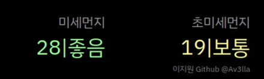

# Air Pollution Module / 미세먼지 모듈


[](https://mit-license.org/)

### Magic Mirror Module

A module for the [MagicMirror](https://github.com/MichMich/MagicMirror) to display a [*air pollution*](https://en.wikipedia.org/wiki/Air_pollution) using api from [한국환경공단](https://keco.or.kr/).

---

* ## Preview


---

* ## Usage
    You need to install and configure the module for your MagicMirror.

    ### Setup
    Clone the module into your modules folder.
    ```shell
    cd ~/MagicMirror/modules && git clone https://github.com/Av3lla/air-pollution-module
    ```
    ~~### [* Folder name issue](#known-issues)~~

    ### Configuration

    Add the module configuration to your `config.js` file.

    ```js
    {
    	module: 'MMM-AirPollution',
    	position: 'top_right',
    	config: {
            enableHeader: true,
            header: "header",
            key: 'ApiKey',
            location: 'OO구',
            updateInterval: '1000 * 60'
    	}
    },
    ```

    | Option | Description | Default | Required |
    |---|---|---|---|
    | `enableHeader` | enable header if you want. | `true` | X |
    | `header` | set header | `Air Pollution` | X |
    | `key` | 한국환경공단 API키.| `null` | O |
    | `location` | 시 / 구 | `강서구` | O |
    | `updateInterval` | change the update period in Milliseconds. | `1000*60` | X |

---

### NOTE